<!-- Last verified against code: 2026-03-22 -->
# Hyvexa Architecture Diagrams

Visual reference for AI agents and developers. All diagrams reflect the current codebase state.

---

## 1. Module Dependency Graph

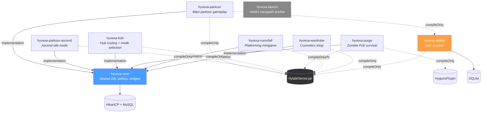

> **Votifier is fully standalone** — no dependency on hyvexa-core, uses SQLite instead of MySQL.

---

## 2. Plugin Initialization Lifecycle

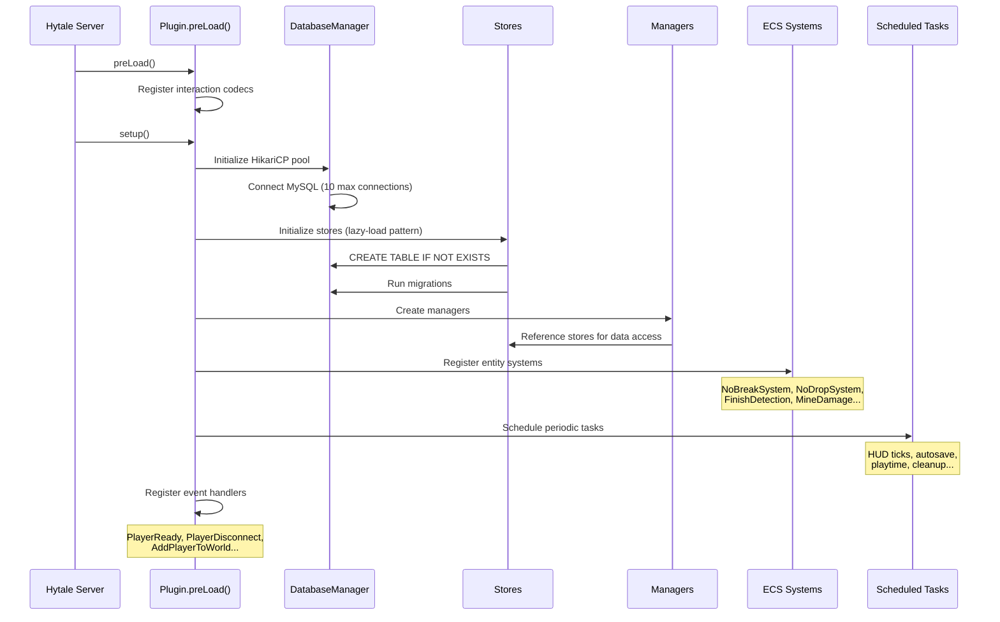

---

## 3. Per-Module Manager Map

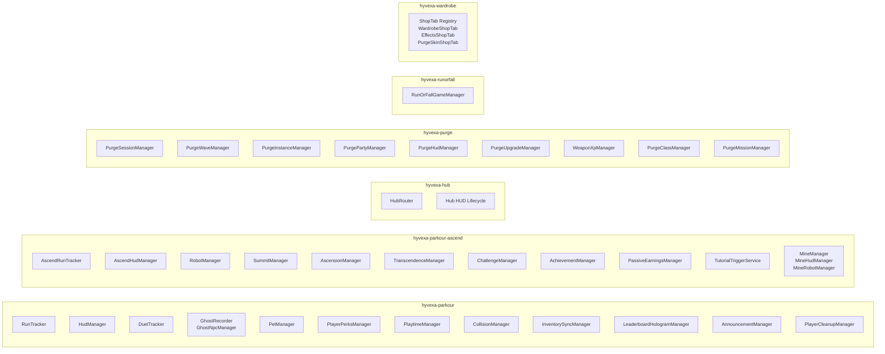

---

## 4. Core Infrastructure

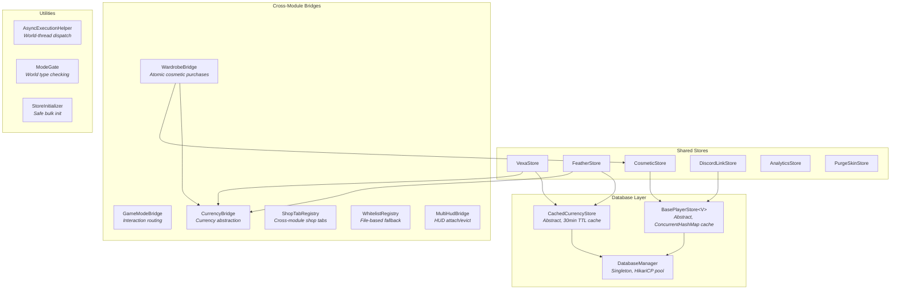

---

## 5. Player Data Flow

### Login

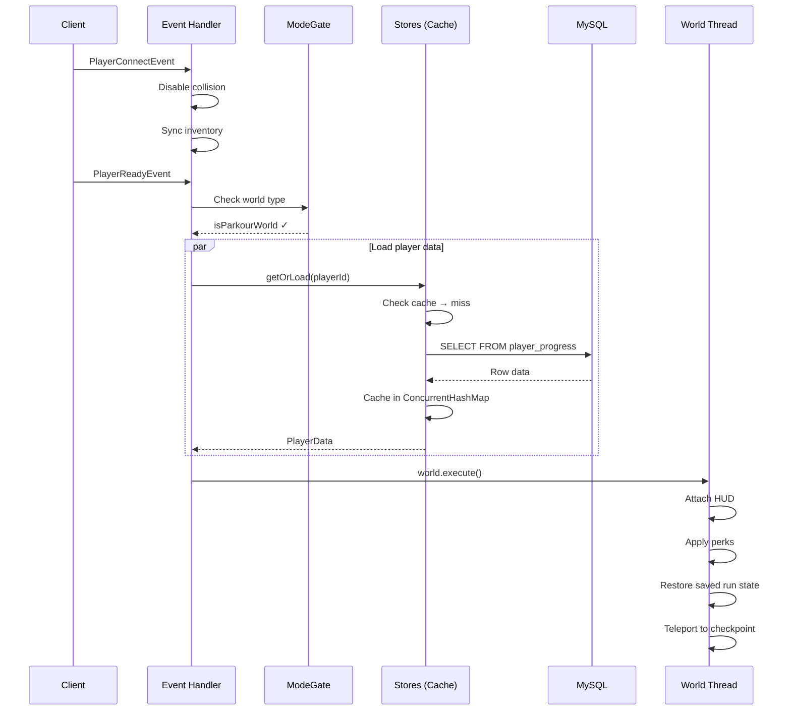

### Disconnect

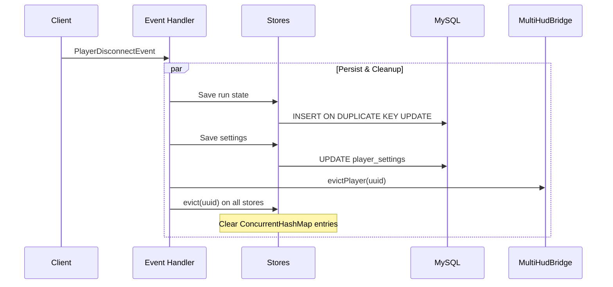

---

## 6. Persistence Pattern

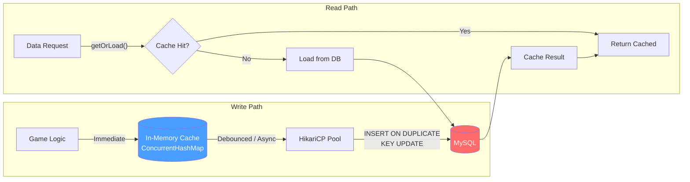

> **Memory-first**: reads always hit cache. Writes update cache immediately, then queue async DB persistence. Player sees no latency.

---

## 7. Threading Model

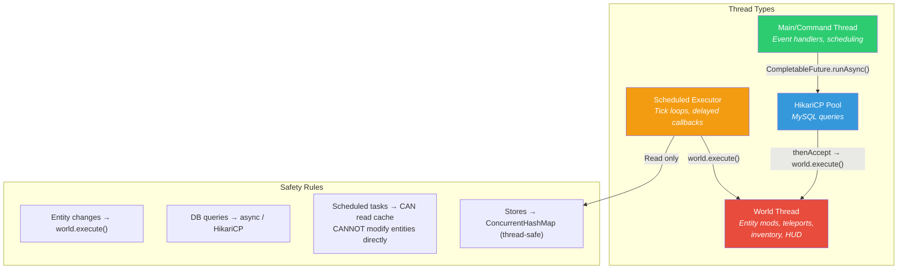

### Async Safety Pattern

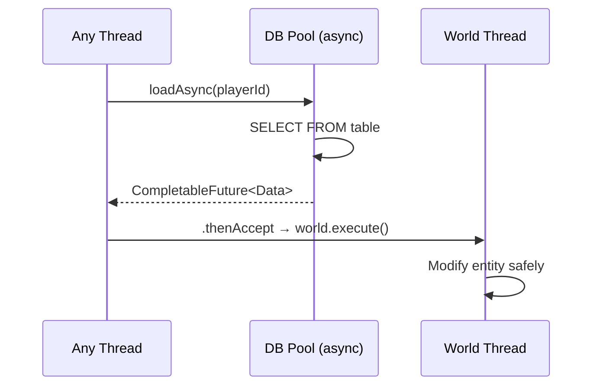

---

## 8. Scheduled Tasks Overview

```mermaid
gantt
    title Tick Intervals by Module
    dateFormat X
    axisFormat %L ms

    section Parkour
    RunTrackerTick (ECS)     :50, 100
    HUD Updates              :100, 200
    Duel Tick                :100, 200
    Collision Removal        :2000, 4000
    Playtime Accumulate      :60000, 120000

    section Ascend
    Main Tick (50ms + 200ms full) :50, 100
    Ghost Recording              :50, 100
    Robot Replay                 :50, 100
    Mine Zone Regen              :1000, 2000

    section Hub
    HUD Recovery      :1000, 2000
    Player Counts     :5000, 10000

    section Purge
    Combo Bar Decay   :50, 100
    HUD Slow Update   :5000, 10000
```

---

## 9. Cross-Module Communication

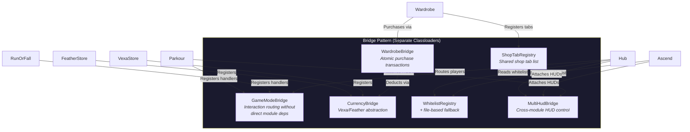

> **Why bridges?** Each plugin loads in its own classloader. Direct singleton access across plugins fails. Bridges use static registries in hyvexa-core (shared classloader) or file-based fallbacks.

---

## 10. UI System

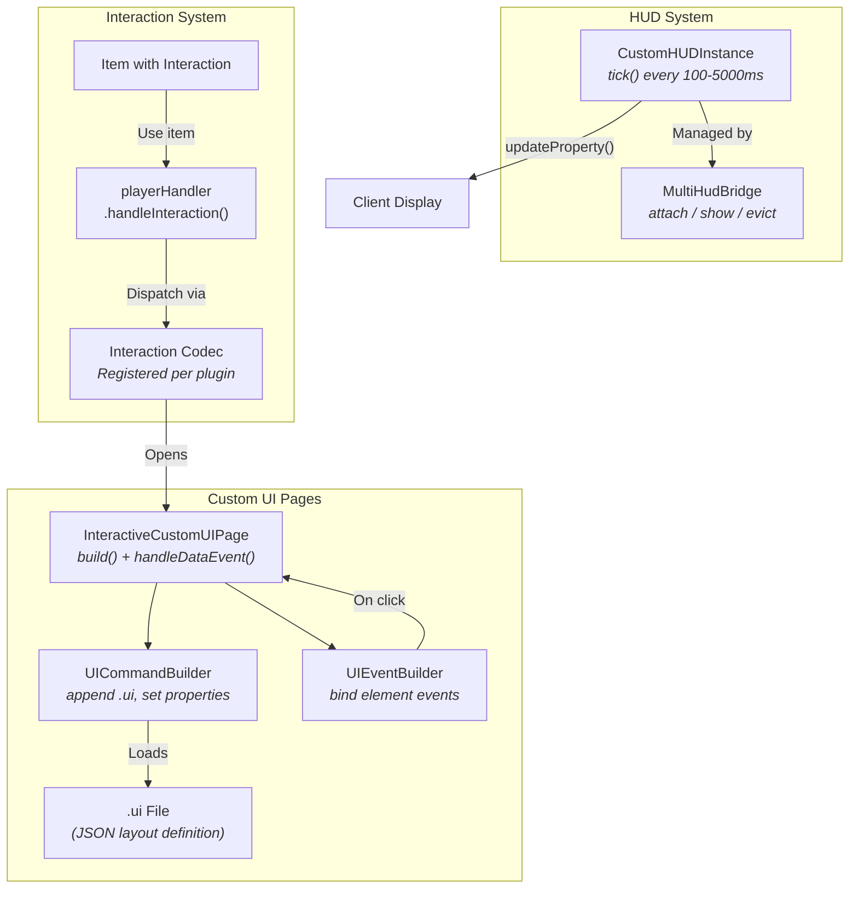

---

## 11. Documentation Map

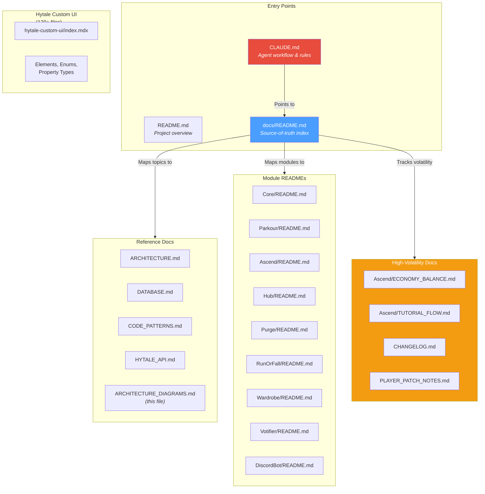

> **Agent reading order**: `CLAUDE.md` → `docs/README.md` (index) → relevant reference doc for the task at hand.
